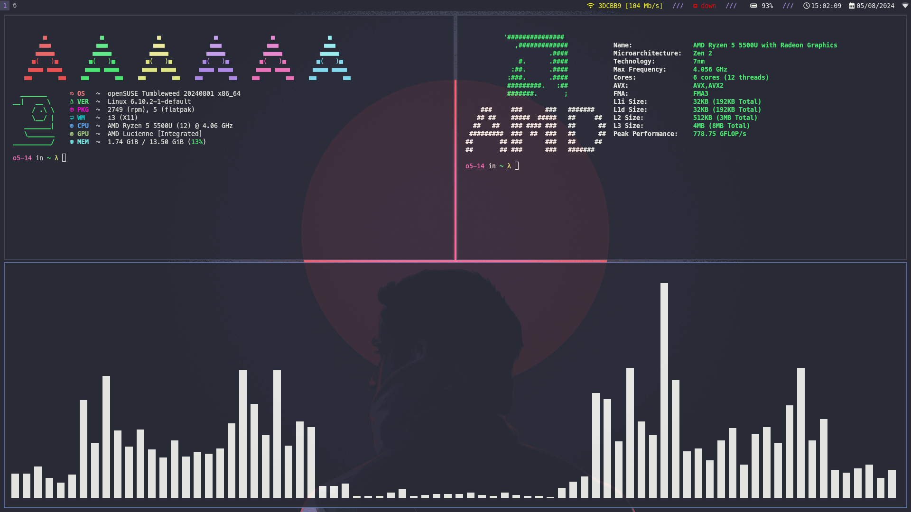
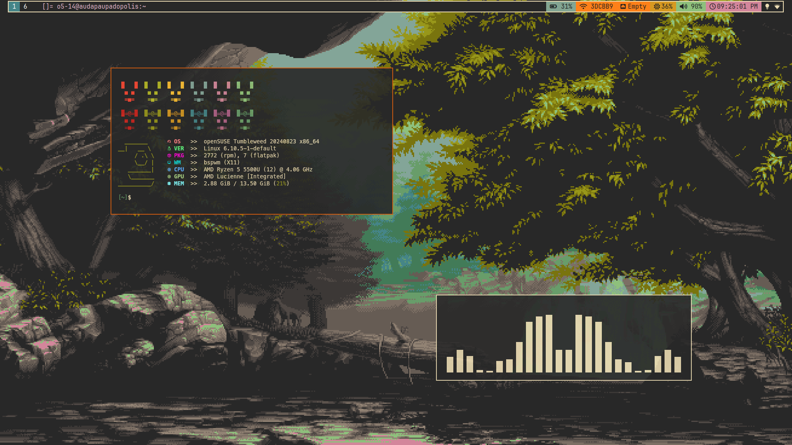

# Dotfiles for openSUSE Tumbleweed

## XFCE + i3

<!--## XFCE + herbstluftwm
-->

## XFCE + bspwm

## Specifications

- Shell: `zsh`
- Terminal: `kitty`
- Text editor: `nvim`
- Browser: `brave`
- Compositor: `picom`
- File manager: `thunar`
