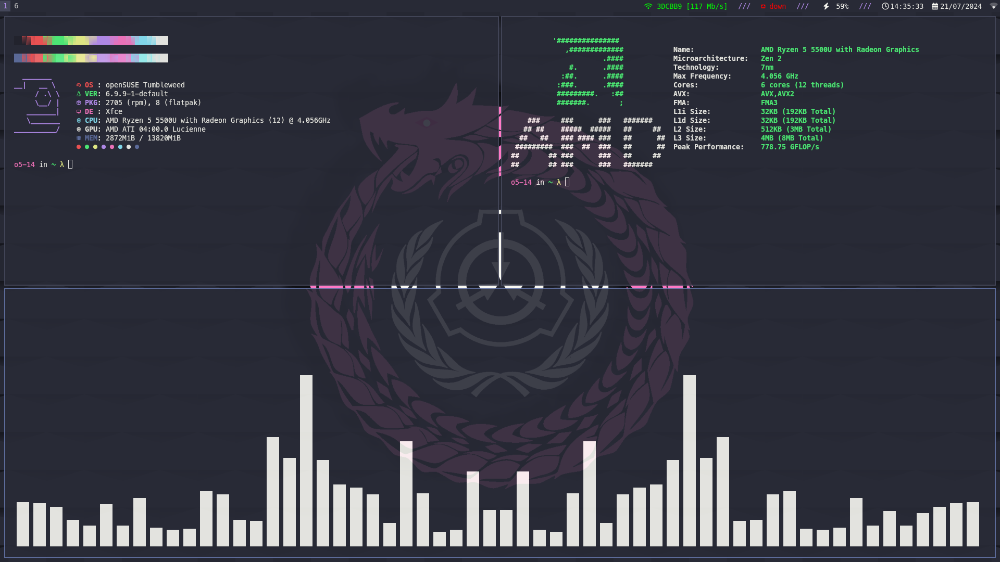

# Dotfiles for openSUSE Tumbleweed

## XFCE + i3

<!--## XFCE + herbstluftwm

## XFCE + bspwm
-->

## Specifications

- Shell: `zsh`
- Terminal: `kitty`
- Text editor: `nvim`
- Browser: `firefox`
- Compositor: `picom`
- File manager: `nemo`
- WMs: `i3`, `herbstluftwm` or `bspwm`
