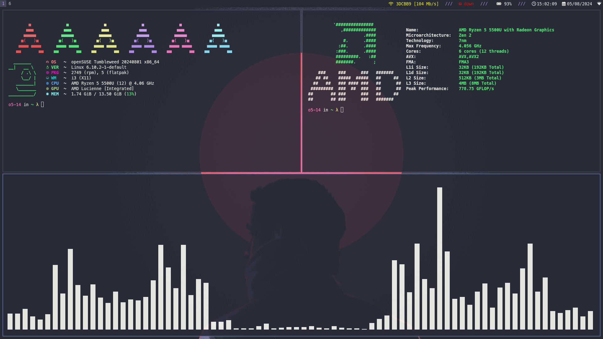
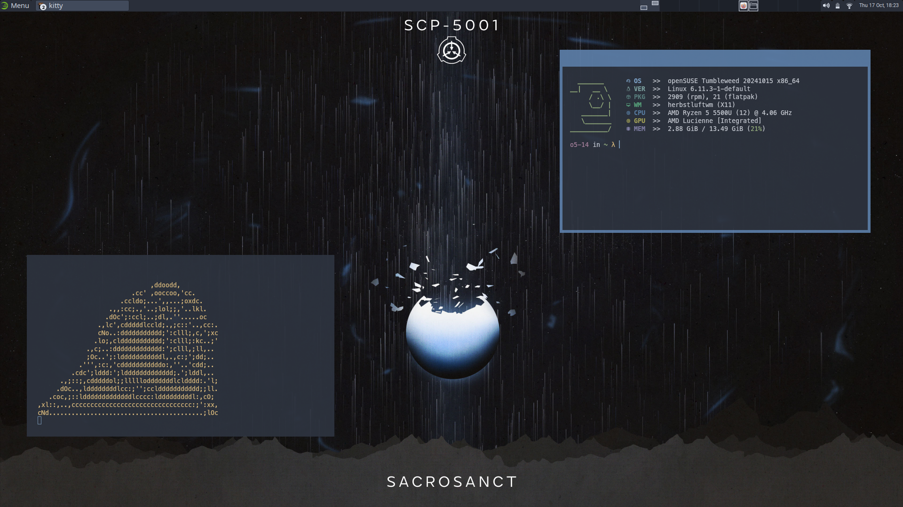
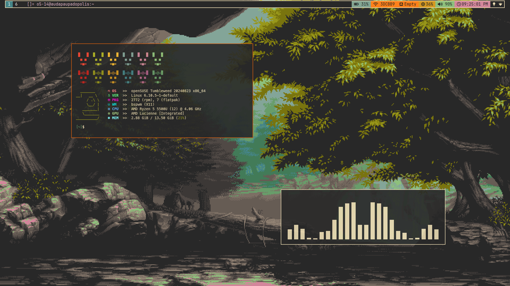

# Dotfiles for openSUSE Tumbleweed

## XFCE + i3

## XFCE + herbstluftwm

## XFCE + bspwm

## Specifications

- Shell: `zsh`
- Terminal: `kitty`
- Text editor: `nvim`
- Browser: `firefox`
- Compositor: `picom`
- File manager: `thunar`
